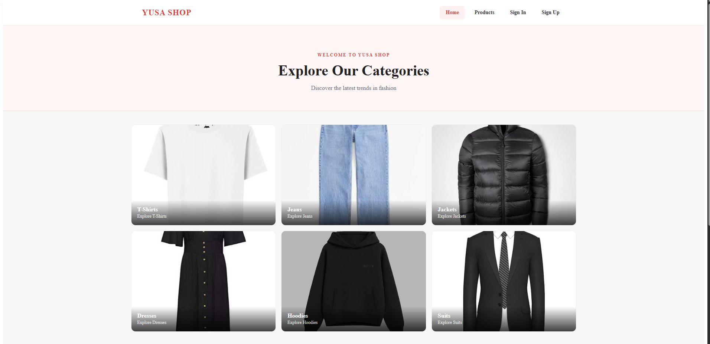
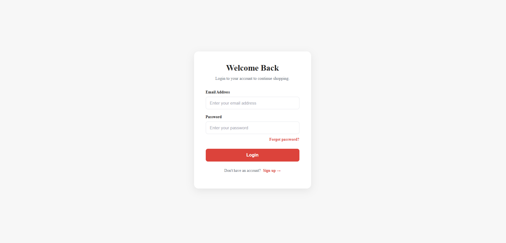
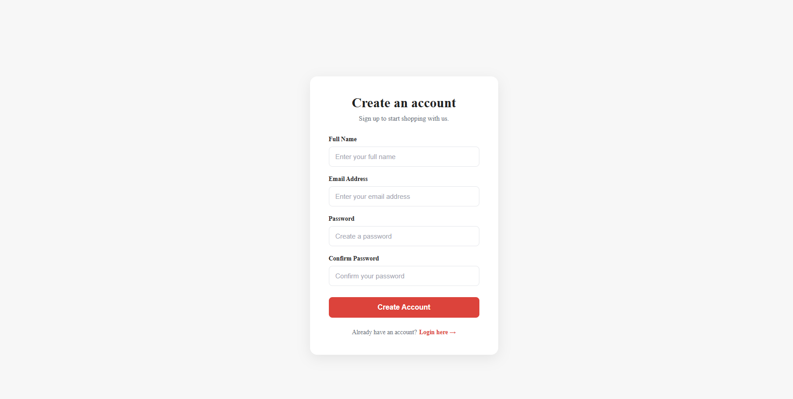
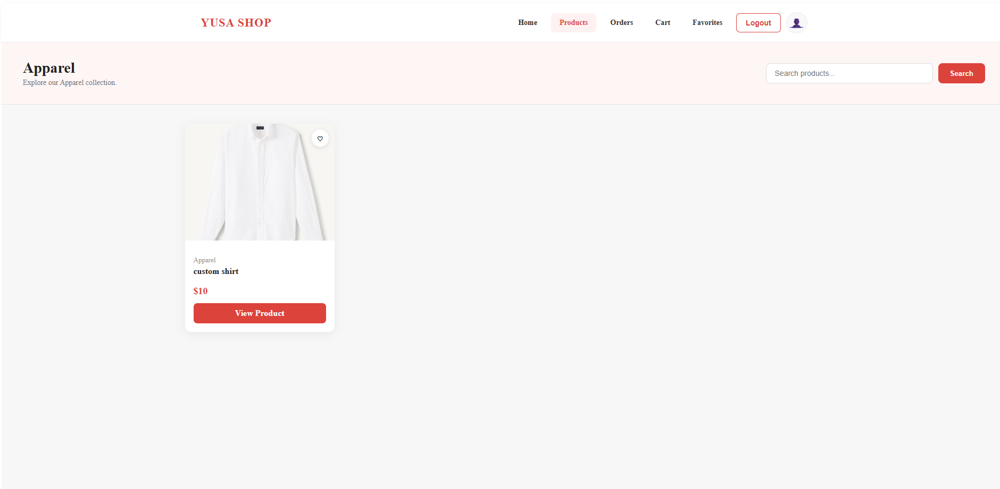
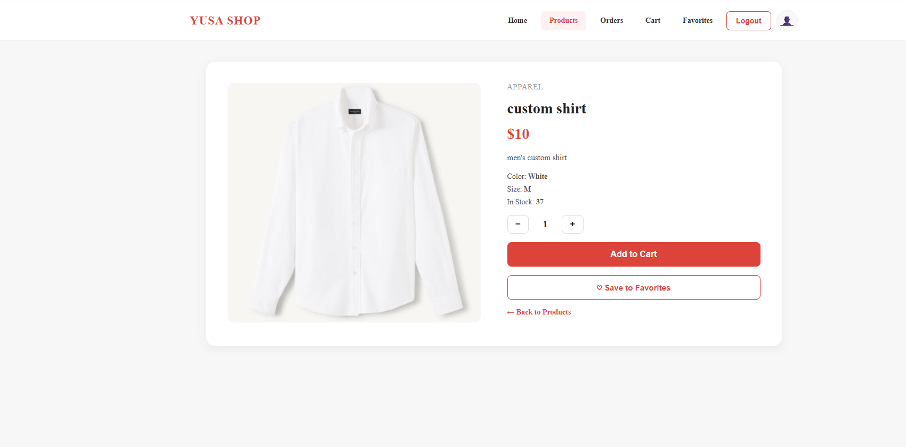
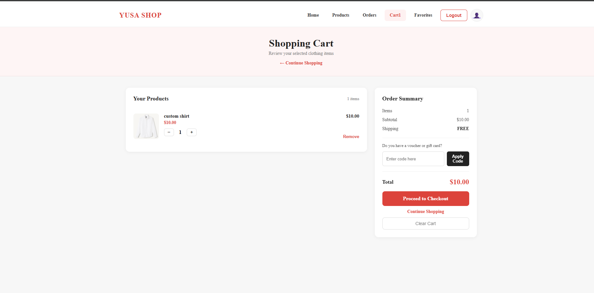
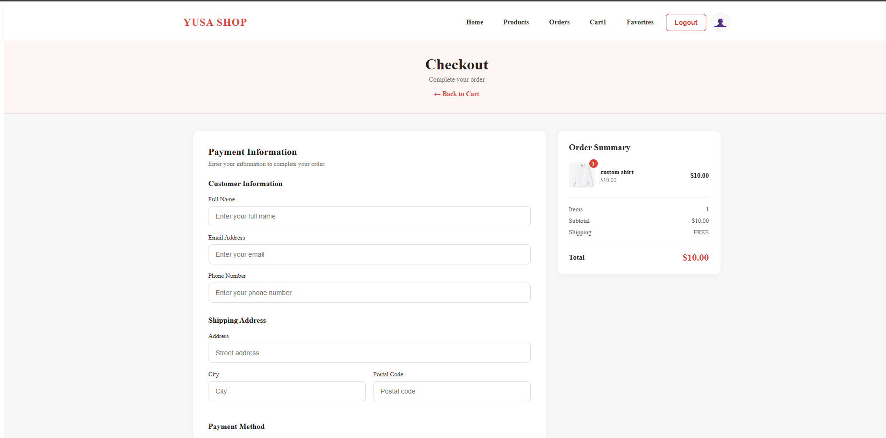
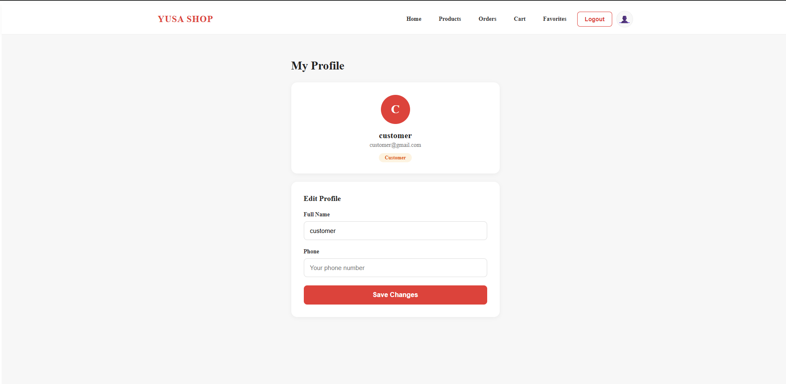

# YUSA Shop — E-Commerce Frontend

Angular frontend for the YUSA Shop e-commerce platform. Provides a full shopping experience including product browsing, cart management, checkout with Chapa payment, order history, favorites, user profile, and an admin dashboard.

---

## 📸 Screenshots

### Home


### Login


### Sign Up


### Product List


### Product Detail


### Shopping Cart


### Checkout


### Profile


---

## 🛠️ Tech Stack

| Concern      | Technology          |
|--------------|---------------------|
| Framework    | Angular             |
| Language     | TypeScript          |
| UI           | HTML / SCSS         |
| Routing      | Angular Router      |
| HTTP         | Angular HttpClient  |
| Auth         | JWT + Interceptor   |
| Testing      | Jasmine / Karma     |
| API          | ShopApi ASP.NET Core 10 |

---

## 📁 Project Structure

```
shop-client/
│   angular.json
│   package.json
│   tsconfig.json
│   README.md
│
├── docs/
│   └── screenshots/
│
└── src/
    │   index.html
    │   main.ts
    │   styles.scss
    │
    ├── app/
    │   │   app.config.ts
    │   │   app.html
    │   │   app.routes.ts
    │   │   app.scss
    │   │   app.spec.ts
    │   │   app.ts
    │   │
    │   ├── core/
    │   │       admin.guard.ts
    │   │       auth.guard.ts
    │   │       auth.interceptor.ts
    │   │       auth.spec.ts
    │   │       auth.ts
    │   │       root.guard.ts
    │   │
    │   ├── features/
    │   │   ├── admin-dashboard/
    │   │   │       admin-dashboard.css
    │   │   │       admin-dashboard.html
    │   │   │       admin-dashboard.spect.ts
    │   │   │       admin-dashboard.ts
    │   │   │
    │   │   ├── admin-login/
    │   │   │       admin-login.html
    │   │   │       admin-login.scss
    │   │   │       admin-login.ts
    │   │   │
    │   │   ├── admin-signup/
    │   │   │       admin-signup.html
    │   │   │       admin-signup.scss
    │   │   │       admin-signup.ts
    │   │   │
    │   │   ├── auth/
    │   │   │   │   verify-email.html
    │   │   │   │   verify-email.scss
    │   │   │   │   verify-email.spec.ts
    │   │   │   │   verify-email.ts
    │   │   │   │
    │   │   │   ├── forgot-password/
    │   │   │   │       forgot-password.html
    │   │   │   │       forgot-password.scss
    │   │   │   │       forgot-password.ts
    │   │   │   │
    │   │   │   ├── login/
    │   │   │   │       login.html
    │   │   │   │       login.scss
    │   │   │   │       login.spect.ts
    │   │   │   │       login.ts
    │   │   │   │
    │   │   │   └── signup/
    │   │   │           signup.html
    │   │   │           signup.scss
    │   │   │           signup.spect.ts
    │   │   │           signup.ts
    │   │   │
    │   │   ├── cart/
    │   │   │       cart.html
    │   │   │       cart.scss
    │   │   │       cart.spec.ts
    │   │   │       cart.ts
    │   │   │
    │   │   ├── checkout/
    │   │   │       checkout.html
    │   │   │       checkout.scss
    │   │   │       checkout.spec.ts
    │   │   │       checkout.ts
    │   │   │       order-success.html
    │   │   │       order-success.scss
    │   │   │       order-success.ts
    │   │   │
    │   │   ├── favorites/
    │   │   │       favorites.html
    │   │   │       favorites.scss
    │   │   │       favorites.spec.ts
    │   │   │       favorites.ts
    │   │   │
    │   │   ├── home/
    │   │   │       home.html
    │   │   │       home.scss
    │   │   │       home.ts
    │   │   │
    │   │   ├── orders/
    │   │   │       order-history.html
    │   │   │       order-history.scss
    │   │   │       order-history.spec.ts
    │   │   │       order-history.ts
    │   │   │
    │   │   ├── products/
    │   │   │       product-detail.html
    │   │   │       product-detail.scss
    │   │   │       product-detail.spec.ts
    │   │   │       product-detail.ts
    │   │   │       product-list.html
    │   │   │       product-list.scss
    │   │   │       product-list.spec.ts
    │   │   │       product-list.ts
    │   │   │
    │   │   └── profile/
    │   │           profile.html
    │   │           profile.scss
    │   │           profile.spec.ts
    │   │           profile.ts
    │   │
    │   ├── models/
    │   │       auth.model.ts
    │   │       cart.model.ts
    │   │       order.model.ts
    │   │       product.model.ts
    │   │
    │   ├── services/
    │   │       cart.ts
    │   │       cart.spec.ts
    │   │       co.ts
    │   │       co.spec.ts
    │   │       favorite.ts
    │   │       favorite.spec.ts
    │   │       order.ts
    │   │       order.spec.ts
    │   │       product.ts
    │   │       product.spec.ts
    │   │       auth.spect.ts
    │   │
    │   └── shared/
    │           footer.html
    │           footer.scss
    │           footer.ts
    │           navbar.html
    │           navbar.scss
    │           navbar.spec.ts
    │           navbar.ts
    │           product-card.html
    │           product-card.scss
    │           product-card.spec.ts
    │           product-card.ts
    │
    └── environments/
            environment.ts
```

---

## ✨ Features

### Authentication
- Login with email and password
- Sign up with full name, email, and password
- Email verification
- Forgot password and reset password flow
- JWT token stored and sent via HTTP interceptor
- Auth guard for protected routes
- Admin guard for admin-only routes
- Root guard for redirect logic

### Products
- Home page with category browsing (T-Shirts, Jeans, Jackets, Dresses, Hoodies, Suits)
- Product list with search and category filter
- Product detail with quantity selector
- Add to cart and save to favorites from detail page
- Reusable product card component

### Cart
- Add, remove, update quantity
- Order summary with subtotal and shipping
- Apply coupon / voucher code
- Proceed to checkout

### Checkout
- Customer information form
- Shipping address
- Payment method selection
- Chapa payment integration
- Order success page

### Orders
- View order history
- Order status tracking

### Favorites
- Toggle favorites from product list or detail
- View all saved favorites

### Profile
- View profile with avatar and role badge
- Edit full name and phone number

### Admin
- Admin login
- Admin signup
- Admin dashboard

---

## 🔐 Authentication & Guards

| Guard | Purpose |
|---|---|
| `auth.guard.ts` | Protects customer routes |
| `admin.guard.ts` | Protects admin routes |
| `root.guard.ts` | Redirects based on role |
| `auth.interceptor.ts` | Attaches JWT to all requests |

---

## 🚀 Getting Started

### Prerequisites
- Node.js
- npm
- Angular CLI
- ShopApi backend running

### 1. Install dependencies

```bash
npm install
```

### 2. Start the backend API

```bash
dotnet run --project ../ShopApi/ShopApi.Api
```

### 3. Start the frontend

```bash
npm start
```

App available at:

```
http://localhost:4200
```

---

## 🧪 Testing

```bash
npm test
```

The project includes tests for:
- App component
- Login component
- Signup component
- Verify email component
- Cart component
- Checkout component
- Favorites component
- Order history component
- Product list component
- Product detail component
- Profile component
- Navbar component
- Product card component
- Cart service
- Favorite service
- Order service
- Product service

---

## 📋 Routes

| Route | Component | Guard |
|---|---|---|
| `/` | Home | — |
| `/login` | Login | — |
| `/signup` | Signup | — |
| `/verify-email` | Verify Email | — |
| `/forgot-password` | Forgot Password | — |
| `/products` | Product List | Auth |
| `/products/:id` | Product Detail | Auth |
| `/cart` | Cart | Auth |
| `/checkout` | Checkout | Auth |
| `/orders` | Order History | Auth |
| `/favorites` | Favorites | Auth |
| `/profile` | Profile | Auth |
| `/admin/login` | Admin Login | — |
| `/admin/signup` | Admin Signup | — |
| `/admin/dashboard` | Admin Dashboard | Admin |

---

## 🏗️ Project Goals

This project is part of the CoTBE Software Engineering Programme and demonstrates:

- Feature-based Angular project structure
- JWT authentication with HTTP interceptor
- Role-based route guards
- Reusable shared components
- Service-based API integration
- Angular reactive forms
- Unit testing with Jasmine/Karma
- Clean Git commit practices

---

## 📄 License

School project — CoTBE Software Engineering Programme 2026.